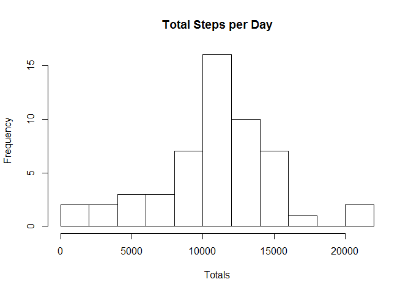

# Assignment1 Reproducible Research
Sarah Bullough  
February 28, 2016  

Set working directory

```r
setwd("C:/Users/Calli6/Desktop/Reproducible Research")
```

Call libraries

```r
library(dplyr)
```

```
## 
## Attaching package: 'dplyr'
```

```
## The following objects are masked from 'package:stats':
## 
##     filter, lag
```

```
## The following objects are masked from 'package:base':
## 
##     intersect, setdiff, setequal, union
```

```r
library(lattice)
```

Download Dataset and Unzip

```r
dataset_url <-"https://d396qusza40orc.cloudfront.net/repdata%2Fdata%2Factivity.zip"
download.file(dataset_url, "activity.zip")
unzip("activity.zip", exdir = "Activity")
```

Read in Dataset Activity

```r
activity <- read.csv("C:/Users/Calli6/Desktop/Reproducible Research/Activity/activity.csv", stringsAsFactors=FALSE)
```

##What is mean total number of steps taken per day?

For this part of the assignment, you can ignore the missing values in the dataset.

Remove missing values from the dataset.

```r
activity_nona <- na.omit(activity)
```

1.    Calculate the total number of steps taken per day.  

```r
stepsperday <- group_by(activity_nona, date) %>% summarize(Totals=sum(steps))
knitr::kable(stepsperday)
```


date          Totals
-----------  -------
2012-10-02       126
2012-10-03     11352
2012-10-04     12116
2012-10-05     13294
2012-10-06     15420
2012-10-07     11015
2012-10-09     12811
2012-10-10      9900
2012-10-11     10304
2012-10-12     17382
2012-10-13     12426
2012-10-14     15098
2012-10-15     10139
2012-10-16     15084
2012-10-17     13452
2012-10-18     10056
2012-10-19     11829
2012-10-20     10395
2012-10-21      8821
2012-10-22     13460
2012-10-23      8918
2012-10-24      8355
2012-10-25      2492
2012-10-26      6778
2012-10-27     10119
2012-10-28     11458
2012-10-29      5018
2012-10-30      9819
2012-10-31     15414
2012-11-02     10600
2012-11-03     10571
2012-11-05     10439
2012-11-06      8334
2012-11-07     12883
2012-11-08      3219
2012-11-11     12608
2012-11-12     10765
2012-11-13      7336
2012-11-15        41
2012-11-16      5441
2012-11-17     14339
2012-11-18     15110
2012-11-19      8841
2012-11-20      4472
2012-11-21     12787
2012-11-22     20427
2012-11-23     21194
2012-11-24     14478
2012-11-25     11834
2012-11-26     11162
2012-11-27     13646
2012-11-28     10183
2012-11-29      7047

2.   Make a histogram of the total number of steps taken each day.

```r
hist(stepsperday$Totals, breaks = 10, main = "Total Steps per Day", xlab = "Totals")
```



3.    Calculate and report the mean and median of the total number of steps taken per day.

```r
meanstepsperday <- mean(stepsperday$Totals)
medianstepsperday <- median(stepsperday$Totals)
```


```r
meanstepsperday
```

```
## [1] 10766.19
```

```r
medianstepsperday
```

```
## [1] 10765
```

##What is the average daily activity pattern?

1. Make a time series plot (i.e. type = "l") of the 5-minute interval (x-axis) 
and the average number of steps taken, averaged across all days (y-axis)

```r
avgstepsperinterval <- group_by(activity_nona, interval) %>% summarize(Mean = mean(steps))

plot(avgstepsperinterval$interval, avgstepsperinterval$Mean
     , type = "l"
     , ylab = "Average Steps per Interval"
     , xlab = "Interval")
```


2. Which 5-minute interval, on average across all the days in the dataset, 
contains the maximum number of steps?

```r
maxstepsperinterval <- group_by(activity_nona, interval) %>% summarize(Max = max(steps))
arrange_by_steps <- arrange(maxstepsperinterval, -Max)
Interval_with_maxsteps <- arrange_by_steps[1,]
knitr::kable(Interval_with_maxsteps)
```


 interval   Max
---------  ----
      615   806

##Imputing missing values

Note that there are a number of days/intervals where there are missing values (coded as NA). 
The presence of missing days may introduce bias into some calculations or summaries of the data.

1.  Calculate and report the total number of missing values in the dataset 
(i.e. the total number of rows with NAs)

Number of dates missing

```r
sum(is.na(activity$date))
```

```
## [1] 0
```

Number of intervals missing

```r
sum(is.na(activity$interval)) #0
```

```
## [1] 0
```

Number of steps missing

```r
sum(is.na(activity$steps)) 
```

```
## [1] 2304
```

2. Devise a strategy for filling in all of the missing values in the dataset. 
Use the mean of the time interval to replace the missing values.

```r
avgstepsperinterval <- group_by(activity_nona, interval) %>% summarize(Mean = mean(steps))
```

3. Create a new dataset that is equal to the original dataset but with the missing data filled in.

```r
activity_means <- left_join(activity, avgstepsperinterval, by = "interval")

activity_means$steps[is.na(activity_means$steps) == TRUE] <- activity_means$Mean
```

```
## Warning in activity_means$steps[is.na(activity_means$steps) == TRUE]
## <- activity_means$Mean: number of items to replace is not a multiple of
## replacement length
```

```r
knitr::kable(head(activity_means))
```

     steps  date          interval        Mean
----------  -----------  ---------  ----------
 1.7169811  2012-10-01           0   1.7169811
 0.3396226  2012-10-01           5   0.3396226
 0.1320755  2012-10-01          10   0.1320755
 0.1509434  2012-10-01          15   0.1509434
 0.0754717  2012-10-01          20   0.0754717
 2.0943396  2012-10-01          25   2.0943396

4. Make a histogram of the total number of steps taken each day and Calculate and report the mean and median total number of steps taken per day. 

```r
stepsperday_new <- group_by(activity_means, date) %>% summarize(Totals=sum(steps))
hist(stepsperday_new$Totals, breaks = 10, main= "Total Steps per Day with NA replacements", xlab = "Totals")
```


```r
mean(stepsperday_new$Totals)
```

```
## [1] 10766.19
```

```r
median(stepsperday_new$Totals)
```

```
## [1] 10766.19
```

Do these values differ from the estimates from the first part of the assignment? What is the impact of imputing missing data on the estimates of the total daily number of steps?

With NAs:

```r
mean(stepsperday$Totals)
```

```
## [1] 10766.19
```

```r
median(stepsperday$Totals)
```

```
## [1] 10765
```

Without NAs:

```r
mean(stepsperday_new$Totals)
```

```
## [1] 10766.19
```

```r
median(stepsperday_new$Totals)
```

```
## [1] 10766.19
```

The mean is exactly the same and the median is slightly higher with the mean for the interval in place of the missing values.

##Are there differences in activity patterns between weekdays and weekends?

For this part the weekdays() function may be of some help here. Use the dataset with the filled-in missing values for this part.

1. Create a new factor variable in the dataset with two levels - "weekday" and "weekend" indicating whether a given date is a weekday or weekend day.

Change date to a correct date format

```r
date_format <- as.data.frame(strptime(activity_means$date, "%Y-%m-%d"))
```

Put new date column back on dataset and change the name

```r
activity_date <- cbind(activity_means, date_format)
colnames(activity_date)[5] <- "date_formatted"
```

Create day variable indicating whether day is a weekday or a weekend

```r
activity_date$weekday <- weekdays(activity_date$date_formatted, abbreviate = TRUE)
weekdays <- c("Mon","Tue","Wed","Thu","Fri")
activity_date$day <- ifelse(activity_date$weekday %in% weekdays, c("weekday"), c("weekend"))
activity_date$day <- factor(activity_date$day)
```

2. Make a panel plot containing a time series plot (i.e. type = "l") of the 5-minute interval (x-axis) and the average number of steps taken, averaged across all weekday days or weekend days (y-axis). See the README file in the GitHub repository to see an example of what this plot should look like using simulated data.

```r
avgstepsperintervalperweekday <- group_by(activity_date, day,interval) %>% summarize(Mean = mean(steps))
attach(avgstepsperintervalperweekday)
xyplot(Mean~interval | factor(day),layout=c(1,2), type = "l")
```


